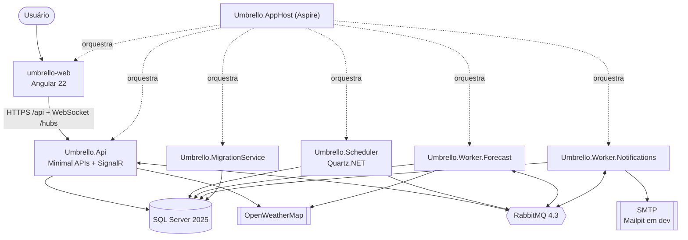
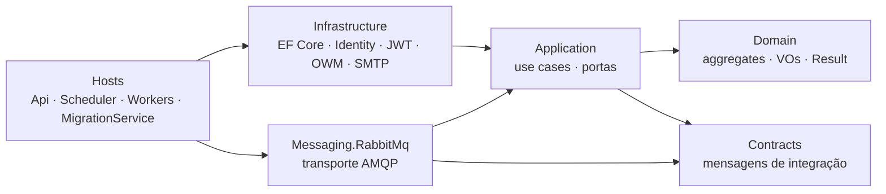
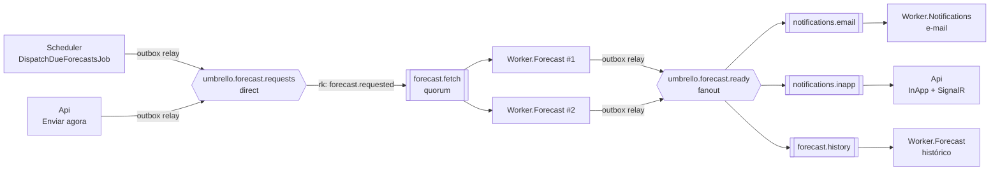
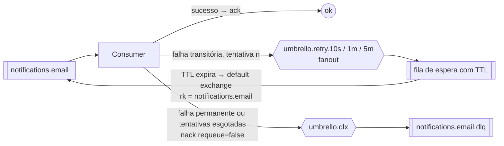
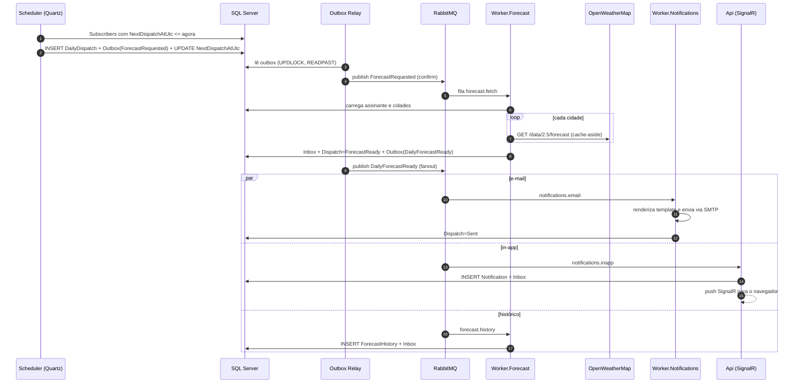
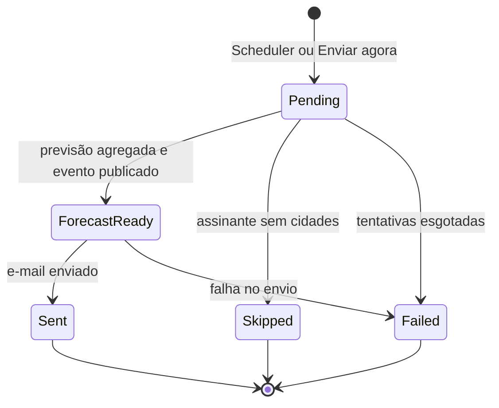
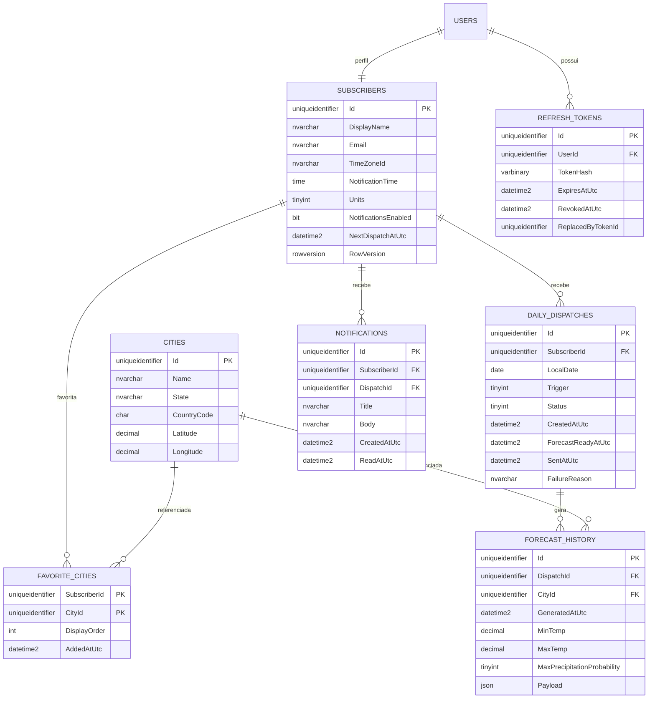

# Umbrello — Planejamento de ponta a ponta

> Documento vivo. Última revisão: **11/09/2026** (troca para .NET 10 LTS).
> Contexto da dupla (status, decisões, próximo passo): [`../CONTEXTO.md`](../CONTEXTO.md).

---

## Sumário

1. [Visão do produto](#1-visão-do-produto)
2. [Escopo (MVP x evoluções)](#2-escopo-mvp-x-evoluções)
3. [Regras de negócio](#3-regras-de-negócio)
4. [Requisitos não funcionais](#4-requisitos-não-funcionais)
5. [Stack e versões](#5-stack-e-versões)
6. [Arquitetura](#6-arquitetura)
7. [Mensageria: scheduled tasks + fanout](#7-mensageria-scheduled-tasks--fanout)
8. [Modelo de dados](#8-modelo-de-dados)
9. [API (contrato inicial)](#9-api-contrato-inicial)
10. [Front-end Angular](#10-front-end-angular)
11. [Padrões de projeto aplicados](#11-padrões-de-projeto-aplicados)
12. [Estratégia de testes](#12-estratégia-de-testes)
13. [Observabilidade, segurança e configuração](#13-observabilidade-segurança-e-configuração)
14. [Estrutura do repositório](#14-estrutura-do-repositório)
15. [Roadmap por fases](#15-roadmap-por-fases)
16. [Riscos e mitigação](#16-riscos-e-mitigação)
17. [Backlog de evoluções](#17-backlog-de-evoluções)
18. [Glossário rápido](#18-glossário-rápido)

---

## 1. Visão do produto

**Umbrello** envia todo dia, por e-mail, a previsão do tempo das cidades favoritas de cada usuário, no horário que ele escolher.

Fluxo principal:

1. O usuário cria uma conta, busca cidades (Geocoding da OpenWeatherMap) e marca suas favoritas.
2. Ele define fuso horário, horário de envio, unidade (°C/°F) e liga as notificações.
3. Uma **tarefa agendada** (Quartz.NET) encontra os usuários cujo horário chegou e publica um comando por usuário.
4. **Consumers concorrentes** buscam a previsão das próximas 24 h de cada cidade e publicam o evento `DailyForecastReady` em uma **exchange fanout**.
5. A fanout entrega o evento a três consumidores independentes: **e-mail**, **notificação in-app em tempo real (SignalR)** e **histórico de previsões**.

Objetivo de portfólio: mostrar domínio de arquitetura limpa, mensageria confiável (outbox, idempotência, retry, DLQ), agendamento distribuído, observabilidade ponta a ponta e um front-end Angular moderno com signals.

---

## 2. Escopo (MVP x evoluções)

### MVP (fases 0–14)

| Área | Funcionalidades |
|---|---|
| Conta | Cadastro, login, refresh token, logout, "meus dados" |
| Cidades | Busca por nome (autocomplete), adicionar/remover/reordenar favoritas (máx. 10) |
| Dashboard | Card por cidade com clima atual e resumo das próximas 24 h |
| Preferências | Fuso (IANA), horário de envio, unidade, liga/desliga notificações |
| Notificações | E-mail diário; notificação in-app ao vivo; caixa de entrada; botão **"Enviar agora"** |
| Histórico | Lista de envios com status (Pending → ForecastReady → Sent / Failed / Skipped) |
| Operação | Dashboard do Aspire (logs, traces, métricas), health checks, DLQ inspecionável |
| Entrega | Docker Compose "tipo produção" e CI no GitHub Actions |

### Fora do MVP

Veja o [backlog de evoluções](#17-backlog-de-evoluções): confirmação de e-mail, alertas de chuva, outros canais (Telegram/Web Push), One Call 3.0, deploy em nuvem etc.

---

## 3. Regras de negócio

| ID | Regra |
|---|---|
| RN01 | Cada usuário pode ter no máximo **10** cidades favoritas. |
| RN02 | Não é permitido favoritar a mesma cidade duas vezes. |
| RN03 | Uma cidade é identificada pelas coordenadas arredondadas em 4 casas decimais (~11 m). Se dois usuários favoritam a mesma cidade, o registro de `City` é compartilhado. |
| RN04 | O envio agendado acontece no horário escolhido, no fuso do usuário, com atraso máximo igual ao intervalo do job (5 min). Horário de verão é tratado pelo `TimeZoneInfo`. |
| RN05 | No máximo **1 envio agendado por usuário por dia local**. Garantido por índice único no banco, não só por código. |
| RN06 | Se o sistema ficou fora do ar e o envio atrasou mais de **2 h**, esse envio é pulado e o próximo é reagendado (não faz sentido mandar a previsão da manhã à noite). |
| RN07 | "Enviar agora" (disparo manual): no máximo **3 por usuário por dia**. |
| RN08 | Só entram no agendamento usuários com notificações ligadas. Se o usuário não tiver cidades no momento da busca, o envio fica com status `Skipped`. |
| RN09 | A previsão cobre as **próximas 24 h** a partir da geração, dividida em períodos no horário local **da cidade**: Madrugada (0–6h), Manhã (6–12h), Tarde (12–18h) e Noite (18–24h). Resumo: mínima, máxima, maior probabilidade de chuva, volume de chuva e condição predominante. |
| RN10 | A previsão de uma mesma coordenada é reaproveitada por **30 min** (cache), para economizar chamadas à API. |
| RN11 | Se uma cidade der erro permanente no provedor (ex.: 404), o e-mail sai com as demais e aquela aparece como "indisponível". Erros transitórios reprocessam a mensagem inteira (retry). |
| RN12 | Quando o usuário altera fuso, horário ou liga as notificações, o próximo envio (`NextDispatchAtUtc`) é recalculado na hora. |
| RN13 | Padrões: unidade métrica, idioma `pt_br`, fuso sugerido pelo navegador. |

---

## 4. Requisitos não funcionais

| Categoria | Requisito |
|---|---|
| Confiabilidade | Entrega *at-least-once* entre serviços; nenhuma mensagem se perde se o RabbitMQ ou um worker cair (outbox + publisher confirms + quorum queues + ack manual). |
| Idempotência | Reprocessar a mesma mensagem não duplica efeitos no banco (inbox). E-mail duplicado só na janela de crash entre enviar e gravar, e essa limitação fica documentada. |
| Escalabilidade | Workers escalam horizontalmente (competing consumers). O scheduler roda em cluster sem disparos duplicados (Quartz clustered + índice único). |
| Resiliência | Chamadas à OpenWeatherMap com timeout, retry com jitter, circuit breaker e rate limit (60 chamadas/min no plano grátis). |
| Observabilidade | Trace distribuído HTTP → banco → outbox → RabbitMQ → consumers; métricas de negócio; logs estruturados. |
| Segurança | JWT curto (15 min), refresh token rotativo em cookie HttpOnly; senhas com Identity; segredos fora do Git; rate limiting na API; cabeçalhos de segurança. |
| Testabilidade | Tempo abstraído com `TimeProvider`; integrações externas atrás de portas; testes de integração com containers reais. |
| Custo | Zero: plano grátis da OpenWeatherMap, Mailpit em dev, CI no GitHub Actions. |
| Qualidade | Warnings como erro, análise estática, testes de arquitetura, lint no front. |

---

## 5. Stack e versões

> Versões verificadas em **11/09/2026**. Confira sempre o patch mais recente ao instalar.

| Camada | Tecnologia | Observação |
|---|---|---|
| Runtime | **.NET 10 LTS** (runtime 10.0.12, SDK 10.0.401) | Suporte até novembro/2028. C# 14. SDK fixado no `global.json` com `rollForward: latestPatch`. |
| API | ASP.NET Core 10 — Minimal APIs, OpenAPI nativo + Scalar, SignalR, Rate Limiting, ProblemDetails | |
| ORM | EF Core 10 (SQL Server) | Tipo `json` nativo do SQL Server 2025 (compatibility level 170). |
| Banco | **SQL Server 2025** (container `mcr.microsoft.com/mssql/server:2025-latest`) | Precisa de ~2 GB de RAM. |
| Mensageria | **RabbitMQ 4.3.x** (`rabbitmq:4.3-management`) + **RabbitMQ.Client 7.x** (API 100% assíncrona) | Quorum queues. **Sem MassTransit** (a v9 é comercial e a v8 só recebe patches até o fim de 2026); usar o client oficial também ensina o protocolo AMQP de verdade. |
| Agendamento | **Quartz.NET 3.x** com JobStore ADO (SQL Server) em modo cluster | |
| Orquestração dev | **Aspire 13.5.x** (AppHost + ServiceDefaults + dashboard) | Integrações: SQL Server, RabbitMQ, Mailpit (Community Toolkit), app JavaScript. |
| Front-end | **Angular 22** (lançado em 03/06/2026) + TypeScript 6 + Angular Material (M3) | Zoneless, OnPush padrão, Signal Forms e `httpResource` estáveis, HttpClient com Fetch, Vitest. |
| Node | Node.js 24 LTS (**mínimo 24.15.0**) | Faixas aceitas pelo Angular 22: `^22.22.3 \|\| ^24.15.0 \|\| ^26.0.0`. |
| Tempo real | SignalR + `@microsoft/signalr` | |
| E-mail | MailKit (SMTP) + template Razor renderizado com `HtmlRenderer` | Mailpit em dev; SMTP real opcional. |
| Clima | OpenWeatherMap: Geocoding, Current Weather e **5 day / 3 hour Forecast** (plano grátis: 60 chamadas/min, 1 mi/mês) | One Call 3.0 exige assinatura "by call"; fica como Strategy alternativa no backlog. |
| Resiliência / cache | `Microsoft.Extensions.Http.Resilience` (Polly v8) + `HybridCache` | |
| Validação | FluentValidation | |
| Pipeline de use cases | Handlers próprios + decorators com Scrutor | **Sem MediatR** (licença comercial); implementar o pipeline ensina o padrão Decorator. |
| Testes .NET | xUnit v3, Shouldly, NSubstitute, Testcontainers (MsSql, RabbitMq), WireMock.Net, ArchUnitNET, `FakeTimeProvider` | Evitar FluentAssertions v8+ (licença comercial). |
| Testes front | Vitest (unitário), Playwright (e2e, opcional) | |
| Qualidade | `.editorconfig`, analyzers .NET, angular-eslint, Prettier | |
| CI | GitHub Actions + GHCR (imagens) | |

---

## 6. Arquitetura

### 6.1 Estilo arquitetural

- **Clean Architecture / Ports & Adapters** dentro de um **monólito modular distribuído em processos**: um único domínio e um único banco (organizado por *schemas*), com hosts separados (API, Scheduler, Workers) que se comunicam por mensagens.
- Por que não microsserviços "de verdade" com um banco por serviço? Para um domínio deste tamanho, isso só acrescentaria complexidade sem ganho. A decisão fica registrada em ADR, mostrando que foi uma escolha consciente de trade-off. As mensagens seguem **Event-Carried State Transfer**, então a separação dos bancos no futuro seria viável.
- **DDD tático leve**: aggregates, value objects e invariantes no domínio.
- **CQRS leve**: commands passam pelo domínio (aggregates + Unit of Work); queries fazem projeção direta com `AsNoTracking`.

### 6.2 Diagrama de containers



### 6.3 Responsabilidade de cada processo

| Processo | Papel | Mensageria |
|---|---|---|
| `Umbrello.Api` | HTTP (auth, cidades, favoritos, preferências, histórico), hub SignalR | **Producer** (via outbox) de `ForecastRequested` no "Enviar agora"; **consumer** da fila `notifications.inapp` |
| `Umbrello.Scheduler` | Jobs Quartz: disparo diário, limpeza, watchdog | **Producer** (via outbox) de `ForecastRequested` |
| `Umbrello.Worker.Forecast` | Busca e agrega a previsão; grava histórico | **Consumer** de `forecast.fetch` e `forecast.history`; **producer** de `DailyForecastReady` |
| `Umbrello.Worker.Notifications` | Monta e envia o e-mail | **Consumer** de `notifications.email` |
| `Umbrello.MigrationService` | Aplica as migrations do EF (e o schema do Quartz) e encerra | — |
| `Umbrello.AppHost` | Orquestra tudo em dev (Aspire) | — |

### 6.4 Camadas e dependências



Regras (validadas pelos testes de arquitetura):

- `Domain` não depende de nenhum outro projeto nem de pacotes de infraestrutura.
- `Application` não conhece EF Core, RabbitMQ, HTTP nem SMTP; só **portas** (interfaces).
- `Contracts` contém apenas `record`s serializáveis, sem lógica e sem dependências.
- Só os hosts fazem a composição (DI) de tudo.

---

## 7. Mensageria: scheduled tasks + fanout

### 7.1 Por que dois estágios (work queue e depois fanout)?

- **Buscar a previsão** precisa acontecer **uma vez** por envio e deve ser distribuído entre várias instâncias → **Competing Consumers** em uma fila única (`forecast.fetch`).
- **Reagir à previsão pronta** tem N efeitos **independentes** (e-mail, in-app, histórico) que não devem se conhecer nem falhar juntos → **Publish/Subscribe** com **exchange fanout**. Cada efeito tem sua própria fila, seu próprio retry e sua própria DLQ.
- Adicionar um canal novo (ex.: Telegram) = **uma fila nova ligada à fanout**, sem tocar no producer. É o Open/Closed no nível da arquitetura.

### 7.2 Topologia



| Recurso | Tipo | Detalhes |
|---|---|---|
| `umbrello.forecast.requests` | exchange **direct**, durable | routing key `forecast.requested` |
| `umbrello.forecast.ready` | exchange **fanout**, durable | publica com routing key vazia |
| `forecast.fetch` | fila quorum | `x-dead-letter-exchange=umbrello.dlx`, `x-dead-letter-routing-key=forecast.fetch`, `x-delivery-limit=10` |
| `notifications.email` | fila quorum | idem, com a própria routing key |
| `notifications.inapp` | fila quorum | idem |
| `forecast.history` | fila quorum | idem |
| `umbrello.retry.10s` / `.1m` / `.5m` | exchanges **fanout** | cada uma ligada a uma fila de espera |
| `umbrello.retry.10s.queue` (etc.) | fila quorum | `x-message-ttl` (10 s / 60 s / 300 s), `x-dead-letter-exchange=""` (default exchange) |
| `umbrello.dlx` | exchange direct | liga `<fila>.dlq` com routing key `<fila>` |
| `<fila>.dlq` | fila quorum | *parking lot* para inspeção e reprocessamento manual |

### 7.3 Retry com backoff e DLQ



Detalhe importante: no retry, o consumer **republica a mensagem com routing key = nome da própria fila** na exchange de espera. Quando o TTL expira, ela volta **só para a fila que falhou** pela default exchange, e **não** passa de novo pela fanout (senão os outros consumidores receberiam duplicado). Depois de publicar o retry com confirm, o original recebe `ack`.

- Tentativa 1 → 10 s; 2 → 1 min; 3 → 5 min; 4ª falha → DLQ. O contador vai no header `x-umbrello-attempt`.
- Mensagem que não desserializa (*poison message*) vai direto para a DLQ.
- `x-delivery-limit` da quorum queue protege contra loop de crash (quando o processo morre antes de dar ack).

### 7.4 Confiabilidade ponta a ponta

| Problema | Solução |
|---|---|
| Gravar no banco e publicar no broker não é atômico | **Transactional Outbox**: o evento é gravado em `messaging.OutboxMessages` na mesma transação do negócio; o `OutboxRelay` (BackgroundService) publica depois. |
| Vários relays lendo a mesma outbox | `SELECT TOP (@n) ... WITH (UPDLOCK, READPAST, ROWLOCK)` dentro de transação. |
| Broker aceitou a mensagem? | **Publisher confirms** (`CreateChannelOptions(publisherConfirmationsEnabled: true, publisherConfirmationTrackingEnabled: true)`). |
| Broker cai | Mensagens persistentes (`DeliveryMode.Persistent`), quorum queues replicáveis, *automatic recovery* do client. |
| Consumer cai no meio | Ack manual só depois do efeito concluído; `prefetch` (QoS) limitado. |
| Mensagem entregue duas vezes | **Idempotent Consumer**: tabela `messaging.InboxMessages (MessageId, Consumer)` gravada na mesma transação do efeito. |
| Scheduler com várias instâncias | Quartz em cluster (JobStore no SQL Server) + `[DisallowConcurrentExecution]` + índice único em `DailyDispatches` + `rowversion` em `Subscribers`. |
| Rastrear um envio de ponta a ponta | `CorrelationId = DispatchId` em todas as mensagens + `traceparent` (W3C) salvo na outbox e propagado nos headers AMQP. |

### 7.5 Contratos de mensagem (`Umbrello.Contracts`)

Envelope (headers AMQP): `message-id`, `correlation-id`, `type` (ex.: `umbrello.forecast-requested.v1`), `content-type: application/json`, `timestamp`, `x-umbrello-attempt`, `traceparent`.

```text
ForecastRequested v1            (comando enxuto; o worker lê o estado atual do banco)
  DispatchId, SubscriberId, Trigger (Scheduled | Manual), RequestedAtUtc

DailyForecastReady v1           (evento "gordo": Event-Carried State Transfer)
  DispatchId, SubscriberId, RecipientEmail, RecipientName,
  Units, TimeZoneId, GeneratedAtUtc,
  Cities[]:
    CityId, Name, CountryCode, State?, Status (Available | Unavailable),
    Summary: MinTemp, MaxTemp, MaxPrecipitationProbability, RainVolumeMm,
             AvgHumidity, MaxWindSpeed, ConditionCode, ConditionDescription, IconCode
    Periods[]: Label (Madrugada | Manhã | Tarde | Noite), Temp, PrecipitationProbability,
               ConditionDescription, IconCode
```

Por que o evento é "gordo"? Assim os três consumidores da fanout não precisam consultar o banco nem a API externa: tudo o que precisam já vem na mensagem.

### 7.6 Agendamento (scheduled tasks)

| Job | Gatilho | O que faz |
|---|---|---|
| `DispatchDueForecastsJob` | cron `0 0/5 * * * ?` (a cada 5 min) | Busca em lotes os `Subscribers` com `NotificationsEnabled = 1 AND NextDispatchAtUtc <= @now`. Para cada um, na mesma transação: cria `DailyDispatch` (ou pula, pela RN06), grava `ForecastRequested` na outbox e recalcula `NextDispatchAtUtc`. |
| `OutboxRelay` | `BackgroundService` + `PeriodicTimer` (2 s) | Publica a outbox pendente. Existe em cada host que produz mensagens. |
| `MessagingCleanupJob` | cron diário 03:00 UTC | Apaga outbox/inbox processadas há mais de 7 dias. |
| `StuckDispatchWatchdogJob` | cron a cada 15 min | Dispatches `Pending`/`ForecastReady` há mais de 30 min viram `Failed` e geram métrica/alerta. |

**Por que `NextDispatchAtUtc`?** O SQL Server não entende fusos IANA. Então o "próximo envio em UTC" é calculado no .NET (`TimeZoneInfo` + `TimeProvider`, já considerando horário de verão) e a query do job fica trivial e indexada.

**Por que Quartz e não só `PeriodicTimer`?** Cron, persistência de triggers, tratamento de *misfire* e cluster sem execução duplicada. O `OutboxRelay` usa `PeriodicTimer` justamente para comparar os dois: laço curto e contínuo vs. job de negócio agendado.

### 7.7 Fluxo completo (sequência)



---
## 8. Modelo de dados

### 8.1 Aggregates do domínio

| Aggregate | Conteúdo | Invariantes |
|---|---|---|
| `Subscriber` (raiz) | `Id` (= Id do usuário no Identity), `DisplayName`, `Email`, `Preferences` (VO: `TimeZoneId`, `NotificationTime` como `TimeOnly`, `Units`, `NotificationsEnabled`), `NextDispatchAtUtc`, `FavoriteCities` (entidades filhas), `RowVersion` | RN01, RN02, RN12 |
| `City` (raiz) | `Id`, `Name`, `State?`, `CountryCode`, `Coordinates` (VO: `Latitude`, `Longitude` arredondadas) | RN03 |
| `DailyDispatch` (raiz) | `Id`, `SubscriberId`, `LocalDate` (`DateOnly`), `Trigger`, `Status`, datas de cada transição, `FailureReason?` | Máquina de estados abaixo; RN05, RN07 |
| `ForecastHistory` | `Id`, `DispatchId`, `CityId`, `GeneratedAtUtc`, resumo, `Payload` (`json`) | Único por (`DispatchId`, `CityId`) |
| `Notification` | `Id`, `SubscriberId`, `DispatchId?`, `Title`, `Body`, `CreatedAtUtc`, `ReadAtUtc?` | — |

### 8.2 Máquina de estados do envio



As transições ficam dentro do aggregate (`dispatch.MarkForecastReady(...)`). Transição inválida retorna `Result.Failure`, nunca lança exceção de negócio.

### 8.3 Diagrama ER (schemas `identity`, `app`, `messaging`, `quartz`)



Tabelas de infraestrutura:

- `messaging.OutboxMessages`: `Id`, `Type`, `Exchange`, `RoutingKey`, `Payload` (json), `CorrelationId`, `TraceParent`, `OccurredAtUtc`, `ProcessedAtUtc?`, `Attempts`, `LastError?`. Índice filtrado `WHERE ProcessedAtUtc IS NULL`.
- `messaging.InboxMessages`: PK (`MessageId`, `Consumer`), `ProcessedAtUtc`.
- `quartz.QRTZ_*`: script oficial do Quartz para SQL Server, aplicado por migration.
- `identity.AspNet*`: tabelas do ASP.NET Core Identity.

### 8.4 Índices-chave

| Tabela | Índice | Motivo |
|---|---|---|
| `Subscribers` | (`NotificationsEnabled`, `NextDispatchAtUtc`) | Query do job agendado |
| `Cities` | único (`Latitude`, `Longitude`) | RN03 |
| `DailyDispatches` | único (`SubscriberId`, `LocalDate`) `WHERE Trigger = Scheduled` | RN05 (defesa no banco) |
| `DailyDispatches` | (`SubscriberId`, `CreatedAtUtc` desc) | Histórico paginado |
| `ForecastHistory` | único (`DispatchId`, `CityId`) | Idempotência |
| `Notifications` | (`SubscriberId`, `ReadAtUtc`, `CreatedAtUtc` desc) | Caixa de entrada |
| `OutboxMessages` | filtrado (`OccurredAtUtc`) `WHERE ProcessedAtUtc IS NULL` | Relay |

---

## 9. API (contrato inicial)

Base: `/api/v1`. Erros em **ProblemDetails (RFC 9457)**. Documentação em `/openapi/v1.json` com UI **Scalar** em `/scalar` (só em dev).

| Método | Rota | Auth | Descrição |
|---|---|---|---|
| POST | `/auth/register` | — | Cria usuário + `Subscriber` |
| POST | `/auth/login` | — | Retorna access token e grava refresh token em cookie HttpOnly |
| POST | `/auth/refresh` | cookie | Rotaciona o refresh token (detecta reuso) |
| POST | `/auth/logout` | ✔ | Revoga o refresh token |
| GET | `/me` | ✔ | Dados do usuário e preferências |
| GET | `/cities/search?q=&limit=5` | ✔ | Geocoding (com cache) |
| GET | `/favorites` | ✔ | Favoritas com clima atual (cache de 10 min) |
| POST | `/favorites` | ✔ | Adiciona favorita `{ name, state, countryCode, latitude, longitude }` |
| DELETE | `/favorites/{cityId}` | ✔ | Remove favorita |
| PUT | `/favorites/order` | ✔ | Reordena `{ cityIds: [] }` |
| GET | `/forecast/{cityId}` | ✔ | Prévia das próximas 24 h (mesmo agregador do worker) |
| GET | `/preferences` | ✔ | Preferências |
| PUT | `/preferences` | ✔ | Atualiza e recalcula `NextDispatchAtUtc` |
| POST | `/dispatches/send-now` | ✔ | Disparo manual (RN07; rate limit) → `202 Accepted` + `dispatchId` |
| GET | `/dispatches?page=&pageSize=` | ✔ | Histórico de envios |
| GET | `/notifications?unreadOnly=` | ✔ | Caixa de entrada |
| PATCH | `/notifications/{id}/read` | ✔ | Marca como lida |
| POST | `/notifications/read-all` | ✔ | Marca todas como lidas |
| WS | `/hubs/notifications` | ✔ | Eventos `notificationReceived` e `unreadCountChanged` |
| GET | `/health`, `/alive` | — | Health checks (ServiceDefaults) |

---

## 10. Front-end Angular

### 10.1 Princípios

- Standalone components, **zoneless**, **OnPush** (padrão no v22), **signals** para estado, `computed`/`linkedSignal` para derivações, `effect` só para efeitos colaterais.
- **Signal Forms** (estáveis no v22) nos formulários de login, cadastro e preferências.
- `httpResource()` para leituras reativas; `HttpClient` para comandos.
- Interceptors e guards **funcionais**; rotas com *lazy loading* por feature.
- Componentes **smart (pages)** x **presentational (UI)**; um **store baseado em signals** por feature, como Facade entre UI e API.
- Angular Material 3 com tema próprio (claro/escuro), layout responsivo, locale `pt-BR`.

### 10.2 Estrutura

```text
src/frontend/umbrello-web/src/app/
├─ core/
│  ├─ auth/            auth.store.ts, auth.interceptor.ts, auth.guard.ts, token refresh
│  ├─ http/            api-base-url, error.interceptor.ts (ProblemDetails → snackbar)
│  ├─ realtime/        notifications-hub.service.ts (SignalR)
│  └─ layout/          shell, toolbar, sidenav, theme toggle
├─ shared/
│  ├─ ui/              weather-icon, empty-state, confirm-dialog, loading-skeleton
│  └─ pipes/           temperature.pipe.ts, wind.pipe.ts
├─ features/
│  ├─ auth/            login.page, register.page
│  ├─ dashboard/       dashboard.page, city-card, forecast-periods
│  ├─ cities/          city-search (autocomplete com debounce)
│  ├─ preferences/     preferences.page (Signal Forms)
│  └─ notifications/   inbox.page, dispatch-history.page, notifications.store
├─ app.config.ts
└─ app.routes.ts
```

### 10.3 Telas

| Tela | Destaques técnicos |
|---|---|
| Login / Cadastro | Signal Forms, validação síncrona e mensagens de ProblemDetails do servidor |
| Dashboard | Grid de cards; `httpResource` por favorita; skeleton loading; "Enviar agora" com feedback |
| Busca de cidade | Autocomplete com sinal *debounced*, cancelamento automático de requisições |
| Preferências | Fuso sugerido via `Intl.DateTimeFormat().resolvedOptions().timeZone`; lista via `Intl.supportedValuesOf('timeZone')`; mostra "próximo envio em…" |
| Notificações | Badge com contagem ao vivo (SignalR); lista com "marcar como lida" |
| Histórico | Tabela paginada com chips de status do envio |

### 10.4 Autenticação no front

- Access token **só em memória** (signal no `AuthStore`), nunca em `localStorage`.
- Refresh token em cookie `HttpOnly; Secure; SameSite=Strict; Path=/api/v1/auth`.
- Na inicialização (`provideAppInitializer`), chama `/auth/refresh` para restaurar a sessão.
- O interceptor trata `401`: faz um único refresh concorrente (as demais requisições esperam) e repete a chamada.
- SignalR usa `accessTokenFactory` com o token atual.
- Em dev, o `ng serve` usa proxy para `/api` e `/hubs` (mesma origem, sem CORS). Em "produção", o nginx faz o proxy reverso.

---

## 11. Padrões de projeto aplicados

| Padrão | Onde | Por quê |
|---|---|---|
| Clean Architecture / Ports & Adapters | Solução inteira | Domínio isolado e testável; infraestrutura substituível |
| Aggregate, Entity, Value Object (DDD) | `Domain` | Invariantes (RN01–RN05) protegidas em um único lugar |
| Result pattern | `Domain`/`Application` → API | Erros de negócio explícitos, sem exceções para controle de fluxo |
| CQRS (leve) | `Application` | Escrita via domínio; leitura via projeção otimizada |
| Repository + Unit of Work | `Infrastructure` (EF Core) | Persistência de aggregates e transação única com a outbox |
| Decorator | Pipeline de handlers (validação, logging, transação) | Cross-cutting concerns sem MediatR |
| Options pattern (+ validação no start) | Configurações (OWM, SMTP, JWT, RabbitMQ) | Falha rápida com configuração inválida |
| Adapter / Anti-Corruption Layer | `OpenWeatherMapClient` → `IWeatherProvider` | O modelo da OWM não vaza para o domínio |
| Strategy | `IWeatherProvider` (2.5 x One Call 3.0), `INotificationChannel` | Troca de provedor ou canal sem alterar use cases |
| Template Method | `RabbitMqConsumer<TMessage>` (base) | Esqueleto fixo (desserializar → idempotência → handler → ack/retry/DLQ) com passo variável |
| Factory | Criação de canais AMQP e de mensagens de envelope | Centraliza configuração (confirms, QoS, headers) |
| Cache-Aside | `HybridCache` para geocoding, clima atual e previsão | RN10 e limite do plano grátis |
| Transactional Outbox | `messaging.OutboxMessages` + `OutboxRelay` | Atomicidade entre banco e broker |
| Idempotent Consumer (Inbox) | `messaging.InboxMessages` | Semântica *at-least-once* segura |
| Competing Consumers | Fila `forecast.fetch` | Escala horizontal da busca |
| Publish/Subscribe | Exchange fanout `umbrello.forecast.ready` | Efeitos independentes e extensíveis |
| Retry com backoff + Dead Letter Channel | Exchanges de espera com TTL + `umbrello.dlx` | Falhas transitórias x permanentes |
| Correlation Identifier / Message Envelope (EIP) | Headers AMQP | Rastreabilidade e versionamento de contratos |
| Event-Carried State Transfer | `DailyForecastReady` | Consumidores autônomos, sem consulta extra |
| Circuit Breaker, Timeout, Rate Limiter | `AddStandardResilienceHandler` no HttpClient da OWM | Protege a API externa e o próprio sistema |
| Scheduler Agent Supervisor (simplificado) | `StuckDispatchWatchdogJob` | Detecta fluxos que travaram |
| Optimistic Concurrency | `rowversion` em `Subscribers` | Scheduler x usuário editando preferências ao mesmo tempo |
| Refresh Token Rotation | Auth | Mitiga roubo de refresh token |
| Observer / Reactive | Signals no Angular, SignalR | UI reativa e tempo real |
| Facade (store) + Smart/Presentational | Front-end | Componentes simples e testáveis |

---

## 12. Estratégia de testes

| Nível | Projeto | Ferramentas | O que cobre |
|---|---|---|---|
| Unitário — domínio | `Umbrello.Domain.Tests` | xUnit v3, Shouldly | Invariantes, VOs, máquina de estados, **cálculo de `NextDispatchAtUtc` com horário de verão** |
| Unitário — aplicação | `Umbrello.Application.Tests` | + NSubstitute, `FakeTimeProvider` | Handlers, **agregador de previsão (TDD)**, regras RN06/RN07/RN11 |
| Arquitetura | `Umbrello.Architecture.Tests` | ArchUnitNET | Regras de dependência entre camadas e convenções de nomes |
| Integração — infraestrutura | `Umbrello.Infrastructure.IntegrationTests` | Testcontainers (MsSql, RabbitMq), WireMock.Net | Migrations, outbox com concorrência, topologia, retry/DLQ reais, cliente OWM com respostas gravadas |
| Integração — API | `Umbrello.Api.IntegrationTests` | `WebApplicationFactory`, Testcontainers | Endpoints, auth, ProblemDetails, rate limit |
| Ponta a ponta (opcional) | `Umbrello.EndToEnd.Tests` | `Aspire.Hosting.Testing` | Do "Enviar agora" ao e-mail no Mailpit |
| Front unitário | `umbrello-web` | Vitest, Angular Testing Library (opcional) | Stores, interceptors, pipes, componentes |
| Front e2e (opcional) | `umbrello-web/e2e` | Playwright | Login → favoritar → enviar agora |

Convenções: nome `Metodo_Cenario_ResultadoEsperado`, padrão AAA, *builders* para dados de teste e sem `Thread.Sleep` (usar `FakeTimeProvider` ou *polling* com timeout).

---

## 13. Observabilidade, segurança e configuração

### Observabilidade

- **OpenTelemetry** via ServiceDefaults: traces (ASP.NET Core, HttpClient, EF Core, RabbitMQ.Client, Quartz), métricas e logs exportados para o dashboard do Aspire (OTLP).
- `ActivitySource("Umbrello.Messaging")` próprio: o relay restaura o `traceparent` salvo na outbox, então o trace fica **HTTP → outbox → broker → consumers** sem quebra.
- `Meter("Umbrello")` com métricas de negócio: `umbrello.dispatches.created`, `umbrello.dispatches.failed`, `umbrello.emails.sent`, `umbrello.owm.requests` (tag `cache_hit`), `umbrello.outbox.pending`, `umbrello.consumer.retries`.
- Health checks: SQL Server, RabbitMQ e a idade da mensagem mais antiga pendente na outbox.

### Segurança

- Identity com política de senha, *lockout* e e-mail único.
- JWT HS256 (chave ≥ 256 bits em segredo) com `iss`, `aud`, `exp` de 15 min e `ClockSkew` curto.
- Refresh token aleatório de 64 bytes; no banco só o **hash** SHA-256; rotação a cada uso; reuso detectado revoga a família inteira.
- Rate limiting: `auth` (5/min por IP), `send-now` (RN07), global por usuário.
- Cabeçalhos de segurança (HSTS, `X-Content-Type-Options`, CSP no nginx), HTTPS em todos os ambientes.
- Autorização por *ownership*: todo query filtra por `SubscriberId` do token (evita IDOR).
- Segredos: `dotnet user-secrets` / parâmetros secretos do Aspire em dev; variáveis de ambiente e `.env` (fora do Git) no Compose; GitHub Secrets no CI.

### Configuração (Options)

```text
OpenWeatherMap: BaseUrl, GeoBaseUrl, ApiKey*, Units, Language, CacheMinutes
Jwt:            Issuer, Audience, SigningKey*, AccessTokenMinutes, RefreshTokenDays
Smtp:           Host, Port, UseSsl, User*, Password*, FromName, FromAddress
Messaging:      Prefetch, RetryDelays [10s, 1m, 5m], OutboxBatchSize, OutboxPollingInterval
Scheduling:     DispatchCron, BatchSize, MaxLateness (2h), ManualDailyLimit (3)
ConnectionStrings: umbrellodb*, rabbitmq*   (injetadas pelo Aspire em dev)
```

`*` = segredo.

---

## 14. Estrutura do repositório

```text
umbrello/
├─ .github/workflows/ci.yml
├─ deploy/
│  ├─ docker-compose.yml
│  ├─ .env.example
│  └─ nginx/default.conf
├─ docs/
│  ├─ PLANEJAMENTO.md
│  ├─ adr/                         0001-arquitetura.md, 0002-mensageria-sem-masstransit.md, ...
│  └─ images/                      screenshots e GIF de demonstração
├─ src/
│  ├─ backend/
│  │  ├─ Umbrello.AppHost/
│  │  ├─ Umbrello.ServiceDefaults/
│  │  ├─ Umbrello.Domain/
│  │  ├─ Umbrello.Contracts/
│  │  ├─ Umbrello.Application/
│  │  ├─ Umbrello.Infrastructure/
│  │  ├─ Umbrello.Messaging.RabbitMq/
│  │  ├─ Umbrello.Api/
│  │  ├─ Umbrello.Scheduler/
│  │  ├─ Umbrello.Worker.Forecast/
│  │  ├─ Umbrello.Worker.Notifications/
│  │  └─ Umbrello.MigrationService/
│  └─ frontend/
│     └─ umbrello-web/
├─ tests/
│  ├─ Umbrello.Domain.Tests/
│  ├─ Umbrello.Application.Tests/
│  ├─ Umbrello.Architecture.Tests/
│  ├─ Umbrello.Infrastructure.IntegrationTests/
│  ├─ Umbrello.Api.IntegrationTests/
│  └─ Umbrello.EndToEnd.Tests/     (opcional)
├─ .editorconfig
├─ .gitignore
├─ CLAUDE.md
├─ CONTEXTO.md
├─ Directory.Build.props           Nullable, TreatWarningsAsErrors, AnalysisLevel, LangVersion
├─ Directory.Packages.props        Central Package Management
├─ global.json                     SDK fixado
├─ README.md
└─ Umbrello.slnx                   formato novo de solução (XML)
```

Organização interna de `Umbrello.Application` (por feature, *vertical slices* dentro da camada):

```text
Umbrello.Application/
├─ Abstractions/     ICommandHandler, IQueryHandler, IUnitOfWork, IWeatherProvider,
│                    IEmailSender, IIntegrationEventOutbox, IMessageHandler<T>, IInbox
├─ Behaviors/        ValidationDecorator, LoggingDecorator, TransactionDecorator
├─ Auth/  Favorites/  Preferences/  Dispatching/  Forecasts/  Notifications/
└─ DependencyInjection.cs
```

---
## 15. Roadmap por fases

### Como trabalhamos em cada passo

1. **Claude** explica o objetivo e os conceitos do passo e entrega o código completo pelo chat.
2. **Você** implementa, roda, testa e faz o commit.
3. **Claude** valida o que você escreveu (lendo os arquivos da pasta ou o que você colar), aponta ajustes e atualiza o `CONTEXTO.md`.
4. Ao fim de cada fase: PR `feat/fase-XX-nome` → `main` e checklist de "Pronto quando" marcado.

Tamanho relativo: **P** (1 sessão) · **M** (2–3 sessões) · **G** (4+ sessões).

### Visão geral

| Fase | Nome | Tamanho | Depende de |
|---|---|---|---|
| 0 | Ambiente e fundação do repositório | P | — |
| 1 | Aspire, ServiceDefaults e infraestrutura local | P | 0 |
| 2 | Domínio e persistência | M | 1 |
| 3 | Autenticação (Identity + JWT + refresh) | M | 2 |
| 4 | Integração OpenWeatherMap (ACL + resiliência + cache) | M | 2 |
| 5 | Casos de uso: cidades, favoritos, preferências | M | 3, 4 |
| 6 | Front-end I: base, auth, dashboard, favoritos, preferências | G | 5 |
| 7 | Fundação de mensageria (RabbitMQ, outbox, inbox, retry, DLQ) | G | 2 |
| 8 | Scheduler: Quartz + disparo diário + "Enviar agora" | M | 5, 7 |
| 9 | Worker.Forecast: busca, agregação e publicação na fanout | M | 4, 8 |
| 10 | Consumidores da fanout: e-mail, in-app (SignalR), histórico | M | 9 |
| 11 | Front-end II: notificações ao vivo e histórico | M | 6, 10 |
| 12 | Hardening: watchdog, métricas, rate limit, testes de caos | M | 10 |
| 13 | Containerização, Docker Compose e CI | M | 11 |
| 14 | Polimento de portfólio | P | 13 |

---

### Fase 0 — Ambiente e fundação do repositório · P

**Objetivo:** máquina pronta e solução compilando com a estrutura de projetos e as regras de qualidade.

**Conceitos:** SDK pinning, Central Package Management, `.slnx`, analyzers, ADR.

Passos:

- [ ] 0.1 Instalar: .NET 10 SDK (10.0.401 ou superior na faixa 10.0.4xx), Node 24 LTS (≥ 24.15.0), Angular CLI 22, Docker Desktop (WSL2), Aspire CLI, Git; IDE (Visual Studio 2026, Rider ou VS Code + C# Dev Kit).
- [ ] 0.2 Criar conta na OpenWeatherMap e gerar a API key (a ativação pode levar algumas horas).
- [ ] 0.3 `global.json`, `Directory.Build.props`, `Directory.Packages.props`, `.editorconfig`; complementar o `.gitignore` (Node/Angular, `.vs`, `.idea`).
- [ ] 0.4 Criar `Umbrello.slnx` e os projetos vazios de `src/backend` e `tests` com as referências da seção 6.4.
- [ ] 0.5 `Umbrello.Architecture.Tests` com as primeiras regras de dependência.
- [ ] 0.6 `docs/adr/0001-arquitetura.md` e `0002-mensageria-sem-masstransit.md`.

**Pronto quando:** `dotnet build` e `dotnet test` passam sem warnings; os testes de arquitetura estão verdes.

---

### Fase 1 — Aspire, ServiceDefaults e infraestrutura local · P

**Objetivo:** um comando (`aspire run`) sobe SQL Server, RabbitMQ (com management), Mailpit e a API.

**Conceitos:** orquestração, service discovery, OpenTelemetry, health checks, parâmetros secretos.

Passos:

- [ ] 1.1 `Umbrello.ServiceDefaults` (OTel, health checks, resiliência padrão, service discovery).
- [ ] 1.2 `Umbrello.AppHost`: `AddSqlServer(...).WithDataVolume().AddDatabase("umbrellodb")`, `AddRabbitMQ("rabbitmq").WithManagementPlugin().WithDataVolume()`, `AddMailPit("mailpit")`, parâmetro secreto `owm-api-key`.
- [ ] 1.3 `Umbrello.Api` mínima com `/health` e `/alive`, referenciando os recursos (`WithReference`, `WaitFor`).
- [ ] 1.4 Registrar os hosts ainda vazios (Scheduler, Workers, MigrationService) no AppHost.

**Pronto quando:** o dashboard do Aspire mostra todos os recursos saudáveis; a UI do RabbitMQ e a do Mailpit abrem.

---

### Fase 2 — Domínio e persistência · M

**Objetivo:** modelo de domínio com invariantes testadas e banco criado via migrations.

**Conceitos:** Entity x Value Object, Aggregate Root, Result pattern, EF Core Fluent API, owned types, schemas, `rowversion`, migrations aplicadas por um worker dedicado.

Passos:

- [ ] 2.1 Blocos base: `Entity<TId>`, `AggregateRoot<TId>`, `ValueObject`, `Result`/`Result<T>`, `Error`.
- [ ] 2.2 `Coordinates`, `Preferences`, `NotificationTime`, `Units`, `TimeZoneId` (validado com `TimeZoneInfo`).
- [ ] 2.3 Aggregates `Subscriber` (+ `FavoriteCity`), `City`, `DailyDispatch` (máquina de estados), `Notification`, `ForecastHistory`.
- [ ] 2.4 `NextDispatchCalculator` (serviço de domínio) com testes de horário de verão e virada de dia.
- [ ] 2.5 `UmbrelloDbContext`, configurações por entidade, schemas, índices da seção 8.4, conversão para `json`.
- [ ] 2.6 Tabelas `OutboxMessages` e `InboxMessages`; migration com o script do Quartz.
- [ ] 2.7 `Umbrello.MigrationService` (aplica migrations e encerra; os demais hosts usam `WaitForCompletion`).

**Pronto quando:** `Umbrello.Domain.Tests` cobre RN01–RN05 e RN12; o banco é criado ao rodar o AppHost.

---

### Fase 3 — Autenticação · M

**Objetivo:** cadastro, login, refresh e logout seguros.

**Conceitos:** Identity Core, claims, JWT (assinatura, validação), refresh token rotation e detecção de reuso, cookies HttpOnly, ProblemDetails, validação, OpenAPI + Scalar.

Passos:

- [ ] 3.1 Pipeline de use cases: `ICommandHandler`/`IQueryHandler`, decorators (validação, logging, transação) com Scrutor.
- [ ] 3.2 `ApplicationUser : IdentityUser<Guid>` no schema `identity`; `AddIdentityCore`.
- [ ] 3.3 `JwtTokenService` e `RefreshTokenService` (hash, rotação, revogação em família).
- [ ] 3.4 Endpoints `/auth/*` e `/me` com `IEndpoint` por feature; mapeamento `Result` → `IResult`/ProblemDetails.
- [ ] 3.5 Rate limiting da rota de auth; OpenAPI com esquema Bearer; Scalar.
- [ ] 3.6 `Umbrello.Api.IntegrationTests` com Testcontainers: cadastro, login, refresh, reuso de token.

**Pronto quando:** fluxo completo testado; token expirado dá 401; refresh reutilizado revoga a sessão.

---

### Fase 4 — Integração OpenWeatherMap · M

**Objetivo:** porta `IWeatherProvider` com adaptador resiliente, cacheado e testado.

**Conceitos:** Anti-Corruption Layer, typed HttpClient, Options com validação, Polly v8 (retry, circuit breaker, timeout, rate limiter), HybridCache, TDD.

Passos:

- [ ] 4.1 `OpenWeatherMapOptions` com `ValidateDataAnnotations().ValidateOnStart()`.
- [ ] 4.2 DTOs internos da OWM (Geocoding, Current, Forecast 5d/3h) e mapeamento para modelos do domínio.
- [ ] 4.3 `OpenWeatherMapClient` com `AddStandardResilienceHandler` ajustado (rate limit de 60/min).
- [ ] 4.4 `CachedWeatherProvider` (Decorator + HybridCache) com as durações da RN10.
- [ ] 4.5 **TDD** do `ForecastAggregator`: janela de 24 h, períodos no fuso da cidade, condição predominante (RN09).
- [ ] 4.6 Testes com WireMock.Net e JSONs reais gravados (sucesso, 401, 404, 429, timeout).

**Pronto quando:** o agregador tem testes para as bordas de fuso; o cliente degrada corretamente em 429/5xx.

---

### Fase 5 — Casos de uso: cidades, favoritos, preferências · M

**Objetivo:** API completa para o front consumir (sem mensageria ainda).

**Conceitos:** CQRS leve, projeções, paginação, autorização por *ownership*, concorrência otimista.

Passos:

- [ ] 5.1 `SearchCities` (query) com cache.
- [ ] 5.2 `AddFavoriteCity`, `RemoveFavoriteCity`, `ReorderFavorites` (commands, RN01–RN03).
- [ ] 5.3 `GetFavoritesWithCurrentWeather` e `GetForecastPreview` (queries).
- [ ] 5.4 `GetPreferences` e `UpdatePreferences` (recalcula `NextDispatchAtUtc`, RN12; trata `DbUpdateConcurrencyException`).
- [ ] 5.5 Testes de integração dos endpoints.

**Pronto quando:** tudo exercitável pelo Scalar; testes verdes.

---

### Fase 6 — Front-end I · G

**Objetivo:** app Angular navegável com auth, dashboard, busca, favoritos e preferências.

**Conceitos:** standalone, zoneless, signals (`signal`, `computed`, `linkedSignal`, `effect`), Signal Forms, `httpResource`, interceptors e guards funcionais, lazy routes, Material 3, proxy de dev.

Passos:

- [ ] 6.1 `ng new umbrello-web` (Angular 22), Material, ESLint, Prettier, Vitest; registrar no AppHost.
- [ ] 6.2 Shell/layout, tema claro/escuro, rotas lazy, página 404.
- [ ] 6.3 `AuthStore`, `auth.interceptor` (refresh único concorrente), `error.interceptor`, `authGuard`, `provideAppInitializer`.
- [ ] 6.4 Login e cadastro com Signal Forms.
- [ ] 6.5 Dashboard: `city-card`, `forecast-periods`, pipes de temperatura/vento, skeletons.
- [ ] 6.6 Busca de cidade com debounce e adicionar/remover/reordenar (CDK drag and drop).
- [ ] 6.7 Preferências com fuso sugerido e "próximo envio em…".
- [ ] 6.8 Testes Vitest de stores, interceptors e pipes.

**Pronto quando:** fluxo cadastro → favoritar → configurar funciona pelo navegador; lint e testes verdes.

---

### Fase 7 — Fundação de mensageria · G

**Objetivo:** infraestrutura AMQP genérica, confiável e testada, antes de qualquer regra de negócio.

**Conceitos:** AMQP 0-9-1 (connection x channel, exchange, binding, routing key), tipos de exchange, quorum queues, ack/nack, prefetch/QoS, publisher confirms, DLX, TTL, outbox, inbox, propagação de trace.

Passos:

- [ ] 7.1 `Umbrello.Contracts`: `IIntegrationMessage`, `ForecastRequested`, `DailyForecastReady`, constantes de nomes (exchanges, filas, routing keys).
- [ ] 7.2 Conexão via `Aspire.RabbitMQ.Client` (`AddRabbitMQClient`) e `ClientProvidedName` por host.
- [ ] 7.3 `TopologyInitializer` (`IHostedService`): declara exchanges, filas, bindings, retry e DLQ de forma idempotente.
- [ ] 7.4 `RabbitMqPublisher` com confirms, mensagens persistentes, envelope e `traceparent`.
- [ ] 7.5 `RabbitMqConsumer<TMessage>` (Template Method): QoS, desserialização, escopo de DI, inbox, handler, ack, retry escalonado e DLQ.
- [ ] 7.6 Outbox: `IIntegrationEventOutbox` (grava na transação) e `OutboxRelay` (`PeriodicTimer`, `UPDLOCK/READPAST`, lote, backoff de erro).
- [ ] 7.7 Testes de integração com Testcontainers RabbitMq + MsSql: publicar/consumir, retry chega na 4ª tentativa à DLQ, poison message, dois relays concorrentes sem duplicar.

**Pronto quando:** os testes provam at-least-once, idempotência, retry escalonado e DLQ; a topologia aparece na UI do RabbitMQ.

---

### Fase 8 — Scheduler · M

**Objetivo:** producer agendado confiável e disparo manual.

**Conceitos:** Quartz.NET (jobs, triggers, cron, misfire, clustering), `[DisallowConcurrentExecution]`, `TimeProvider`, processamento em lotes, idempotência no banco.

Passos:

- [ ] 8.1 Quartz com `UsePersistentStore` (SQL Server, schema `quartz`) e `UseClustering`.
- [ ] 8.2 `DispatchDueForecastsJob`: lotes, criação do `DailyDispatch`, RN05/RN06, outbox, recálculo do próximo envio (uma transação por assinante).
- [ ] 8.3 `OutboxRelay` registrado no Scheduler.
- [ ] 8.4 `POST /dispatches/send-now` (RN07 + rate limit) usando a mesma outbox, com `OutboxRelay` registrado também na Api; `GET /dispatches`.
- [ ] 8.5 `MessagingCleanupJob`.
- [ ] 8.6 Testes: job com `FakeTimeProvider` (horário chegou, atraso > 2 h, já enviado hoje, duas instâncias concorrentes).

**Pronto quando:** ao ajustar o horário para daqui a 5 min, uma mensagem `ForecastRequested` aparece em `forecast.fetch`.

---

### Fase 9 — Worker.Forecast · M

**Objetivo:** consumir `ForecastRequested`, montar a previsão e publicar `DailyForecastReady` na fanout.

**Conceitos:** competing consumers, prefetch x throughput, Event-Carried State Transfer, erros transitórios x permanentes.

Passos:

- [ ] 9.1 `FetchForecastHandler` (Application): carrega assinante e cidades, busca em paralelo limitado (`Parallel.ForEachAsync` com grau máximo), agrega e trata RN08/RN11.
- [ ] 9.2 Na mesma transação: inbox, `dispatch.MarkForecastReady()` e outbox `DailyForecastReady`.
- [ ] 9.3 Classificação de exceções: transitória (retry) x permanente (DLQ / cidade indisponível).
- [ ] 9.4 Host com `RabbitMqConsumer<ForecastRequested>` + `OutboxRelay`.
- [ ] 9.5 Rodar 2 réplicas no AppHost (`WithReplicas(2)`) e observar a distribuição das mensagens.

**Pronto quando:** "Enviar agora" gera `DailyForecastReady` visível nas três filas da fanout; o trace mostra o caminho inteiro.

---

### Fase 10 — Consumidores da fanout · M

**Objetivo:** três efeitos independentes do mesmo evento.

**Conceitos:** Publish/Subscribe, isolamento de falhas por fila, idempotência com efeitos externos (e-mail), SignalR (hubs, grupos por usuário, autenticação).

Passos:

- [ ] 10.1 **E-mail** (`Worker.Notifications`): template Razor (`HtmlRenderer`) responsivo com ícones e períodos; `MailKitEmailSender`; idempotência pelo status do dispatch; `MarkSent()`.
- [ ] 10.2 **In-app** (Api): consumer grava `Notification` + inbox e envia pelo `IHubContext<NotificationsHub>` para `Clients.User(id)`.
- [ ] 10.3 **Histórico** (`Worker.Forecast`): grava `ForecastHistory` com `Payload` json + inbox.
- [ ] 10.4 Endpoints `/notifications/*`.
- [ ] 10.5 Teste de isolamento: derrubar o SMTP (parar o Mailpit) → e-mail entra em retry/DLQ enquanto in-app e histórico seguem normais.

**Pronto quando:** e-mail chega no Mailpit, a notificação é salva e o histórico é gravado; a falha de um não afeta os outros.

---

### Fase 11 — Front-end II · M

**Objetivo:** tempo real e visibilidade dos envios no app.

Passos:

- [ ] 11.1 `NotificationsHubService` (conexão, reconexão automática, `accessTokenFactory`) exposto como signals.
- [ ] 11.2 Badge de não lidas ao vivo + snackbar ao receber notificação.
- [ ] 11.3 Página de caixa de entrada (marcar como lida / todas).
- [ ] 11.4 Página de histórico de envios com status e paginação.
- [ ] 11.5 Botão "Enviar agora" com estado (enviando → aguardando → recebido).

**Pronto quando:** clicar em "Enviar agora" faz a notificação aparecer sozinha em segundos.

---

### Fase 12 — Hardening · M

**Objetivo:** sistema pronto para falhar bem.

Passos:

- [ ] 12.1 `StuckDispatchWatchdogJob`.
- [ ] 12.2 Métricas de negócio (`Meter`) e health check de idade da outbox.
- [ ] 12.3 Guarda de orçamento diário de chamadas à OWM (contador + alerta).
- [ ] 12.4 Cabeçalhos de segurança, revisão de CORS/cookies, rate limit global.
- [ ] 12.5 Roteiro de caos documentado: derrubar RabbitMQ, SQL Server e um worker durante envios e comprovar recuperação sem perda.
- [ ] 12.6 Reprocessamento de DLQ (endpoint admin ou script documentado com `rabbitmqadmin`).
- [ ] 12.7 (Opcional) Teste ponta a ponta com `Aspire.Hosting.Testing`.

**Pronto quando:** o roteiro de caos passa e está documentado com prints de traces e métricas.

---

### Fase 13 — Containerização, Docker Compose e CI · M

**Objetivo:** rodar tudo sem o Aspire e validar cada PR automaticamente.

Passos:

- [ ] 13.1 Imagens .NET com `dotnet publish /t:PublishContainer` (sem Dockerfile) e imagem do Angular com Dockerfile multi-stage + nginx (proxy `/api` e `/hubs`).
- [ ] 13.2 `deploy/docker-compose.yml`: sqlserver, rabbitmq, mailpit, migrator, api, scheduler, worker-forecast (2 réplicas), worker-notifications, web; healthchecks e `depends_on` com condição.
- [ ] 13.3 `.env.example` e instruções no README.
- [ ] 13.4 `.github/workflows/ci.yml`: build .NET, testes (Testcontainers roda no runner Ubuntu), lint/test/build do Angular, publicação das imagens no GHCR na `main`.
- [ ] 13.5 Proteção da `main` exigindo o CI verde.

**Pronto quando:** `docker compose up` sobe o sistema do zero; o PR mostra o CI verde.

---

### Fase 14 — Polimento de portfólio · P

- [ ] 14.1 README com pitch, GIF de demonstração, diagramas, "como rodar em 1 comando", decisões e trade-offs.
- [ ] 14.2 Seed de demonstração (usuário demo + cidades).
- [ ] 14.3 Revisar ADRs e este planejamento para refletir o que foi feito.
- [ ] 14.4 Badges (CI, .NET, Angular), licença, `CONTRIBUTING` curto.
- [ ] 14.5 (Opcional) Post técnico sobre outbox + fanout + retry no LinkedIn/dev.to.

---

## 16. Riscos e mitigação

| Risco | Impacto | Mitigação |
|---|---|---|
| Tutoriais e documentação já mostrarem APIs do .NET 11 | Baixo | Conferir no seletor de versão do Microsoft Learn se a API existe no .NET 10 antes de passar o código. |
| Nomes de API mudarem (Aspire, Angular 22) em relação ao material da internet | Baixo | Conferir a documentação oficial no início de cada fase antes de passar o código. |
| API key da OWM demorar a ativar | Baixo | Criar a chave na Fase 0; até lá, WireMock/JSONs gravados. |
| Estourar o limite do plano grátis | Médio | Cache (RN10), rate limiter, guarda de orçamento diário, dedupe por coordenada. |
| Docker/WSL2 pesado no Windows (SQL Server ~2 GB) | Médio | Volumes persistentes, `.wslconfig` com memória adequada, parar recursos que não estiverem em uso. |
| E-mails reais caírem no spam | Baixo | Mailpit para a demo; SMTP real (plano grátis de algum provedor) só como extra. |
| Escopo crescer demais | Alto | MVP fechado nas fases 0–14; ideias novas vão para o backlog. |
| Duplicidade de e-mail na janela de crash | Baixo | Documentado como limitação consciente do *at-least-once*; checagem de status antes de enviar. |

---

## 17. Backlog de evoluções

- Confirmação de e-mail e recuperação de senha.
- **Alertas inteligentes**: nova fila na fanout que avalia regras ("chuva > 70%", "máxima > 35 °C") e envia alerta extra. Mostra o Open/Closed da fanout.
- Novos canais: Telegram bot, Web Push (Service Worker).
- `OneCallWeatherProvider` (One Call 3.0) como Strategy alternativa via configuração.
- Exchange **topic** por país/região para estatísticas.
- Backplane do SignalR (Redis) para escalar a API.
- Deploy em nuvem (Azure Container Apps via `aspire deploy`).
- i18n `en-US` no front e no e-mail.
- Gráfico de tendência de temperatura usando `ForecastHistory`.
- Testes de carga (k6) no "Enviar agora" e medição do throughput dos consumers.

---

## 18. Glossário rápido

| Termo | Resumo |
|---|---|
| **Exchange** | "Roteador" do RabbitMQ: recebe mensagens do producer e decide para quais filas vão, conforme o tipo e os bindings. |
| **Direct exchange** | Entrega às filas cujo binding key é igual à routing key da mensagem. |
| **Fanout exchange** | Entrega uma cópia a **todas** as filas ligadas, ignorando a routing key. É o broadcast. |
| **Topic exchange** | Roteia por padrões de routing key com curingas (`*`, `#`). |
| **Binding** | Ligação exchange → fila (com chave, quando o tipo usa chave). |
| **Quorum queue** | Fila replicada (Raft), durável, recomendada no RabbitMQ 4.x; tem `delivery-limit`. |
| **Ack / Nack** | Confirmação do consumer de que processou (ou não) a mensagem. Sem ack, a mensagem volta para a fila. |
| **Prefetch (QoS)** | Quantas mensagens sem ack um consumer pode segurar; controla backpressure. |
| **Publisher confirm** | Confirmação do broker ao producer de que a mensagem foi aceita e persistida. |
| **DLX / DLQ** | Exchange/fila para onde vão mensagens rejeitadas, expiradas ou que excederam o limite de entregas. |
| **TTL** | Tempo de vida da mensagem na fila; usado aqui para criar atraso no retry. |
| **Competing Consumers** | Várias instâncias lendo a mesma fila; cada mensagem é processada por apenas uma. |
| **Publish/Subscribe** | Um evento, vários assinantes independentes, cada um com sua fila. |
| **Transactional Outbox** | Grava o evento na mesma transação do negócio e publica depois, garantindo que nenhum dos dois aconteça sem o outro. |
| **Idempotent Consumer / Inbox** | Registra as mensagens já processadas para ignorar reentregas. |
| **At-least-once** | Garantia de que a mensagem chega pelo menos uma vez (pode duplicar), por isso a idempotência. |
| **Scheduled task / Cron** | Execução baseada em tempo; no Quartz, *job* (o quê) + *trigger* (quando). |
| **Misfire** | Quando um trigger não disparou no horário (ex.: processo parado); o Quartz aplica uma política configurável. |
| **Clustering (Quartz)** | Várias instâncias compartilham o JobStore no banco e só uma executa cada disparo. |
| **Event-Carried State Transfer** | O evento carrega os dados necessários para que os consumidores não precisem consultar a origem. |
| **Anti-Corruption Layer** | Camada que traduz um modelo externo (OWM) para o modelo interno. |
| **Result pattern** | Retornar sucesso/erro como valor em vez de lançar exceção para fluxo esperado. |
| **Signals (Angular)** | Primitivas reativas síncronas (`signal`, `computed`, `effect`) que permitem detecção de mudança precisa sem Zone.js. |
